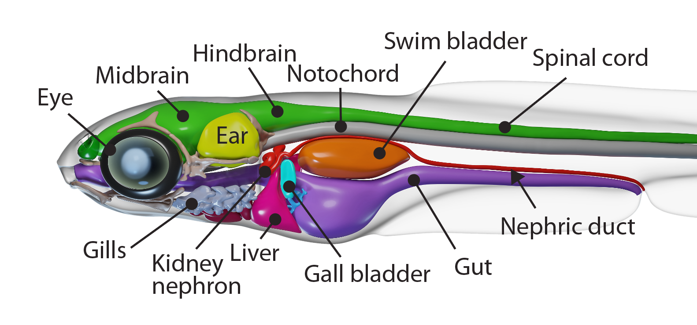

# Whole Body Model

3D geometric model of the young zebrafish built from Whole-Body Expansion Microscopy data. 

This is an accompanying repository to the manuscript: **Imaging cellular activity simultaneously across all organs of a vertebrate reveals body-wide circuits**.

### Acknowledgments

Contributing authors: 
Virginia M. S. Ruetten, Igor Siwanowicz, Mark Eddison, Amy Hu, Gudrun Ihrke, Aparna Dev, Alyson Petruncio, Paul W. Tillberg, Maneesh Sahani, and Misha B. Ahrens. Igor Siwanowicz built the model from data generated and annotated by the rest of the team. 

The work was funded by Janelia Research Campus, HHMI.